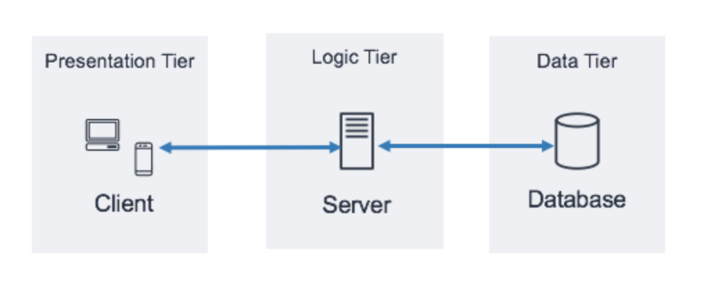

<h2>What is a 3-tier architecture? What is it used for?</h2>

<h4>The three-tier architecture is the most popular implementation of a multi-tier architecture and consists of a single presentation tier, logic tier and data tier</h4>
<h4>It is a viable choice for software projects to be started quickly</h4>

### Resources need to be created / installed :

- Custom VPC

- 2 Subnets (Public)

- 1 Subnet (Private)

- 2 EC2 Instances

- Security Group

- Elastic IP

- NAT Gateway

- Internet Gateway

- Route Table

- Application Load Balancer

- Apache Webserver

- MySQL DB
  
  
