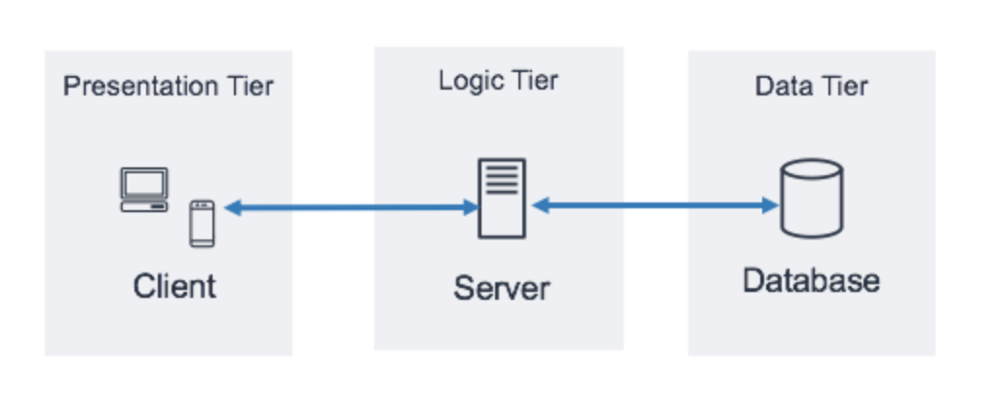

<h3>What is a 3-tier architecture? What is it used for?</h3>

<h1>The three-tier architecture is the most popular implementation of a multi-tier architecture and consists of a single presentation tier, logic tier and data tier</h1>
<h1>It is a viable choice for software projects to be started quickly</h1>

